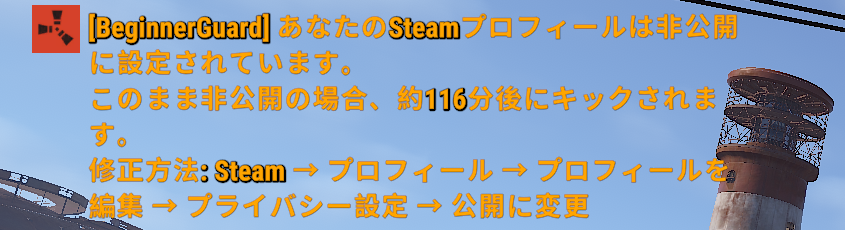

# Beginner Guard

[Oxide/uMod](https://umod.org/) 向け [Rust](https://store.steampowered.com/app/252490/Rust/) プラグインです。  
接続してきたプレイヤーの Steam Rust プレイ時間を自動確認し、初心者サーバーを守ります。

**バージョン:** 1.5.0 | **作者:** Mazurk4_ | **ライセンス:** [MIT](LICENSE)

---

## スクリーンショット



*プロフィールが非公開の場合に表示されるチャット警告（オレンジ色）*

---

## 何をするプラグイン？

プレイヤーが接続すると、**Steam Web API** でその人の Rust 総プレイ時間を取得します。

| 状況 | 結果 |
|------|------|
| 時間数 ≤ 上限、プロフィール公開 | そのまま入場 |
| 時間数 > 上限 | チャット警告 → 一定時間後にキック |
| プロフィール非公開、グレース期間内 | チャット警告 + グレース満了時にキック |
| プロフィール非公開、グレース超過（警告回数残あり） | 警告キック（カウント +1） |
| プロフィール非公開、警告回数使い果たし | 一時BAN発行 |
| BAN中に再接続 | 残り時間を表示して即キック |

チャット警告は**オレンジ色**で表示され、多言語に対応しています。  
オンライン中のプレイヤーは**定期的に再チェック**されます。

---

## 必要要件

- Rust サーバーへの [Oxide/uMod](https://umod.org/) のインストール
- 無料の **Steam Web API キー** — 取得先: https://steamcommunity.com/dev/apikey

---

## クイックスタート

```
1. BeginnerGuard.cs を  oxide/plugins/  にコピー
2. oxide.reload BeginnerGuard
3. oxide/config/BeginnerGuard.json を開いて "Steam API Key" を設定
4. oxide.reload BeginnerGuard
```

---

## 機能

- **プレイ時間ゲート** — 時間上限を超えたプレイヤーを警告後にキック
- **プロフィール非公開対応** — グレース期間 → 警告キック → 一時BAN の段階的処理
- **BAN 自動解除** — 時間が来ると自動解除。手動作業不要
- **免除パーミッション** — VIP・スタッフ・信頼済みプレイヤーをチェック対象外にできる
- **定期再チェック** — 設定間隔でオンライン全プレイヤーを再検証
- **色付きチャット警告** — オレンジ色（`#FFA500`）で見やすく表示
- **多言語対応** — 英語・日本語標準搭載。`oxide/lang/` に追加するだけで他言語も対応可能
- **保存モード切り替え** — 即時保存（デフォルト）と定期保存（遅延書き込み）を設定で選択可能。大規模サーバーのディスク IO 削減に有効
- **古いレコードの自動削除** — 設定日数（デフォルト90日）以上接続のないプレイヤーのレコードを起動時に自動削除し、データファイルの肥大化を防ぐ

---

## 設定

ファイル: `oxide/config/BeginnerGuard.json`  
テンプレートは [`config/BeginnerGuard.json.example`](config/BeginnerGuard.json.example) を参照してください。

| キー | デフォルト | 説明 |
|------|-----------|------|
| `Steam API Key` | *(必須)* | Steam Web API キー |
| `Max allowed Rust playtime on Steam (hours)` | `1000` | この時間数を超えるとキック対象 |
| `Private profile: max cumulative server playtime before kick (minutes)` | `120` | 非公開プロフィールに許容するサーバー累積滞在時間 |
| `Steam API periodic check interval (seconds)` | `1800` | オンラインプレイヤーの再チェック間隔（デフォルト: 30分） |
| `Steam API retry interval on failure (seconds)` | `1800` | API エラー時の再試行間隔 |
| `Over-limit player: delay before kick after warning (seconds)` | `300` | 警告からキックまでの待機時間（プレイ時間超過） |
| `Private profile: delay before kick after warning (seconds)` | `300` | 警告からキックまでの待機時間（非公開プロフィール） |
| `Private profile: max warning kicks before BAN` | `2` | BAN に移行するまでの警告キック回数 |
| `BAN duration (seconds)` | `86400` | BAN の長さ（デフォルト: 24時間） |
| `Skip checks for Oxide admins` | `true` | Oxide 管理者を自動で免除する |
| `Enable debug logging` | `false` | サーバーコンソールに詳細ログを出力する |
| `Deferred data save` | `false` | `false` = 変更のたびに即時保存（デフォルト）、`true` = タイマーによる定期保存（大規模サーバー向け） |
| `Data save interval (seconds)` | `300` | 定期保存の間隔（秒）— `Deferred data save` が `true` のときのみ有効 |
| `Stale record prune age (days, 0 = disabled)` | `90` | この日数以上接続のないプレイヤーのレコードを起動時に自動削除。`0` で無効 |

---

## パーミッション

| パーミッション | 効果 |
|----------------|------|
| `beginnerguard.exempt` | 全チェックをスキップ（VIP・スタッフ向け） |
| `beginnerguard.admin` | ゲーム内 F1 コンソールから `bg.*` コマンドを使用可能 |

```
oxide.grant group  <グループ名>  beginnerguard.exempt
oxide.grant group  <グループ名>  beginnerguard.admin
oxide.grant user   <SteamID64>  beginnerguard.exempt
```

---

## コンソールコマンド

**サーバーコンソール / RCON** からはパーミッションなしで使用できます。  
**ゲーム内 F1 コンソール**から使用するには `beginnerguard.admin` が必要です。

| コマンド | 説明 |
|---------|------|
| `bg.help` | コマンド一覧を表示 |
| `bg.check <SteamID64>` | プレイヤーの保存データを表示 |
| `bg.unban <SteamID64>` | アクティブな BAN を解除 |
| `bg.forcecheck <SteamID64>` | Steam API チェックを即時実行（オンライン中のみ） |
| `bg.reset <SteamID64>` | プレイヤーの保存データを全リセット |
| `bg.prune` | 設定の保持日数を超えた古いレコードを即時削除 |
| `bg.debug <on\|off>` | リロードなしでデバッグログのオン/オフ切替 |

---

## 動作フロー

```
プレイヤー接続
    │
    ├─ 免除対象（管理者 / beginnerguard.exempt）?  → 入場
    ├─ BAN 中?                                  → キック（残り時間を表示）
    │
    └─ Steam API でプレイ時間を取得
           │
           ├─ プロフィール非公開 / API エラー
           │       ├─ グレース期間内?              → チャット警告 + 満了時にキック
           │       ├─ グレース超過、警告回数残あり?  → 警告キック（カウント +1）
           │       └─ グレース超過、警告回数ゼロ?   → BAN 発行
           │
           └─ プロフィール公開
                   ├─ 時間数 ≤ 上限? → 入場
                   └─ 時間数 > 上限? → チャット警告 + 遅延後キック
```

---

## 多言語対応

言語ファイルは初回起動時に `oxide/lang/{言語コード}/BeginnerGuard.json` へ**自動生成**されます。

| 言語 | コード | 状態 |
|------|--------|------|
| English | `en` | デフォルト |
| 日本語 | `ja` | 標準搭載 |

**新しい言語を追加するには:**

1. `oxide/lang/en/BeginnerGuard.json` を `oxide/lang/<コード>/BeginnerGuard.json` にコピー
2. 値（メッセージ本文）を翻訳する — **キーは変更しないこと**
3. `oxide.reload BeginnerGuard`

メッセージ一覧とプレースホルダーの詳細は [`lang/en/BeginnerGuard.json`](lang/en/BeginnerGuard.json) を参照してください。

---

## データ保存

プレイヤーのデータは `oxide/data/BeginnerGuard.json` に保存され、サーバー再起動後も引き継がれます。  
記録内容: Steam時間数 · プロフィール公開状態 · サーバー累積滞在時間 · 警告キック回数 · BAN解除時刻 · 最終接続日時

**保存モード**（設定で切り替え可能）:
- **即時保存**（デフォルト）— 変更のたびにディスクへ書き込む。小規模サーバー向け。
- **定期保存** — 変更をまとめてタイマー間隔で書き込む。大規模サーバーのディスク IO 削減に有効。BAN の発行・解除は保存モードに関係なく常に即時書き込み。

**古いレコードの自動削除** — サーバー起動時に `Stale record prune age` 日数を超えた未接続プレイヤーのレコードを自動削除します。オンライン中またはBAN中のプレイヤーは対象外です。v1.5.0 より前に作成されたレコード（最終接続日時が未記録）は移行安全のため初回はスキップされます。

---

## コントリビューション（貢献）

バグ報告・機能提案・翻訳など、PR は歓迎します。  
詳細は [CONTRIBUTING.md](CONTRIBUTING.md) を参照してください。

---

## ライセンス

[MIT](LICENSE) — Copyright (C) 2024 Mazurk4_
